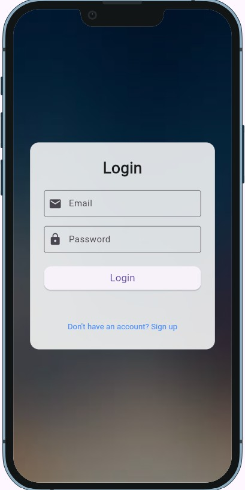
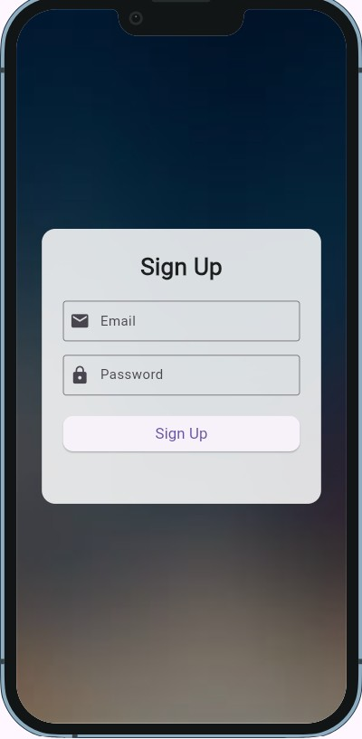
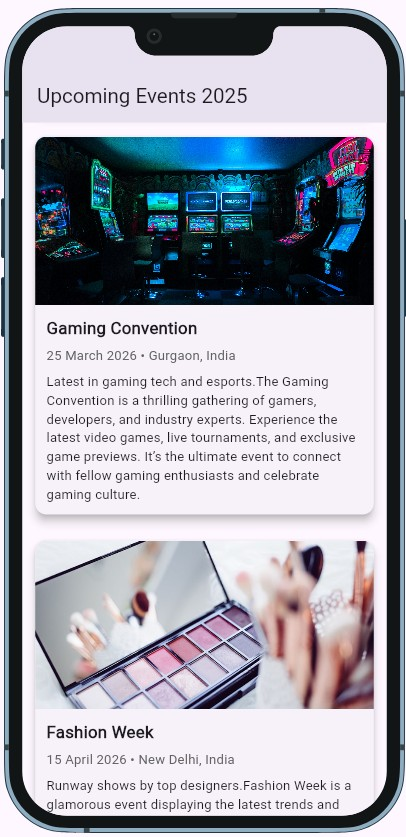
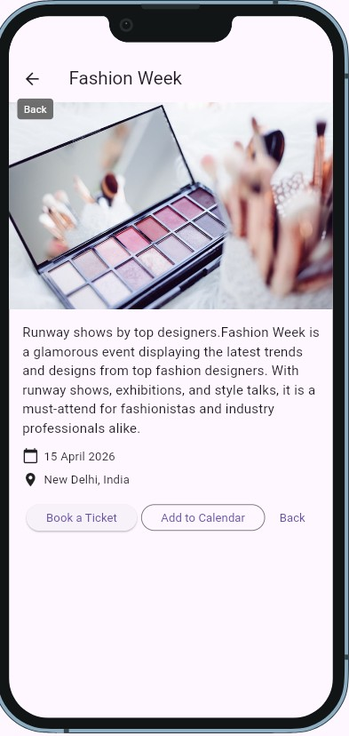
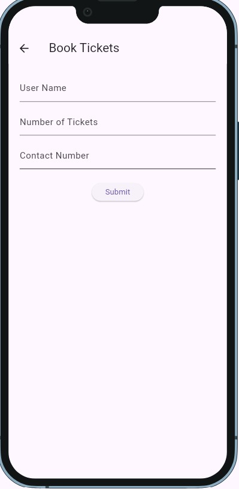
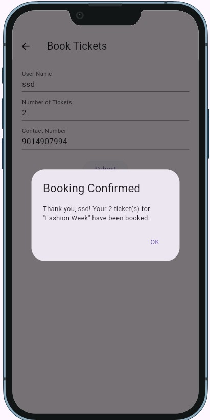

#  Celebrato

Celebrato is a Flutter-based Event Booking Application UI that allows users to browse events, view event details, and book tickets seamlessly.

##  Features

- Splash Screen
- Login & Signup Screen
- Event List Screen
- Event Details Screen
- Ticket Booking Screen
- Responsive UI Design
- Flutter Navigation

##  Tech Stack

- Flutter
- Dart
- Material Design

## 📱 Screenshots

### Splash Screen


### Login Screen



### Signup Screen



### Home Screen



### Event Details Screen



### Booking Screen



### Booking Confirmation Screen




##  Getting Started

1. Clone the repository

```bash
git clone https://github.com/23MH1A4905/Celebrato.git
```

2. Install dependencies

```bash
flutter pub get
```

3. Run the application

```bash
flutter run
```

## Author

Arumilli Satya Sai Devi
